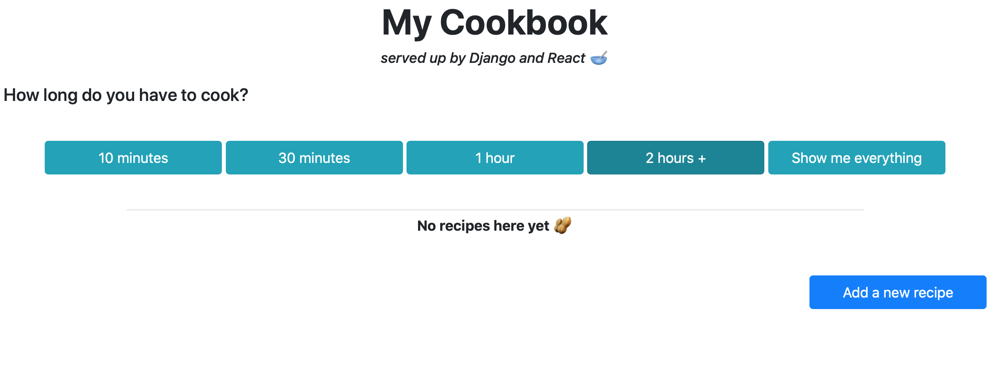

# Cookbook - Frontend

A frontend for a cookbook bootstrapped with create-react-app.

Designed to work with https://github.com/natasharw/cookbook-backend.

 

<kbd></kbd>

 

To run:

* Run `npm start`

* Open [http://localhost:3000](http://localhost:3000) to view in the browser

To test: `npm test`

To build app for production: `npm run build`

#### Requirements
* Node.js
* create-react-app
